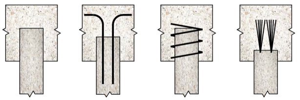
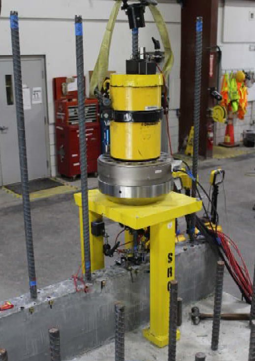

## **Selected Publications**

**Impact of pile-to-cap fixity on the design and behavior of sensitive structures**\
[https://doi.org/10.15554/pcij67.1-01](https://doi.org/10.15554/pcij67.1-01)\
This study challenges the long-standing assumption that pile-to-cap connections behave as pinned connections by demonstrating that substantial fixity can develop even at relatively shallow embedment lengths. Through advanced finite element modeling, the research identifies embedment length and axial compression as the primary parameters governing connection behavior and establishes a mechanics-based framework for predicting connection response. The findings reveal that connection fixity can significantly influence load transfer and overall bridge behavior, with important implications for the design, performance, and reliability of bridge foundations.

---

## **Sponsored Projects**

**Evaluation of Ultra-High-Performance Concrete (UHPC) Pile Splices**\
[Sponsor: Florida Department of Transportation (Co-PI: Seung Jae Lee)](https://rip.trb.org/View/2114140)\
This project addresses a critical challenge limiting the implementation of ultra-high performance concrete (UHPC) piles: the development of reliable and constructible pile splice connections. By combining analytical evaluation, stakeholder-informed design, component-level testing, and experimental validation, the study investigates alternative splice systems and their influence on load transfer, strength, durability, and constructability. The research evaluates both structural and corrosion performance to identify splice details capable of maintaining the exceptional durability and mechanical advantages of UHPC piles. The findings provide the foundation for design recommendations and implementation guidelines that enable the broader use of UHPC foundation systems in bridge infrastructure.

