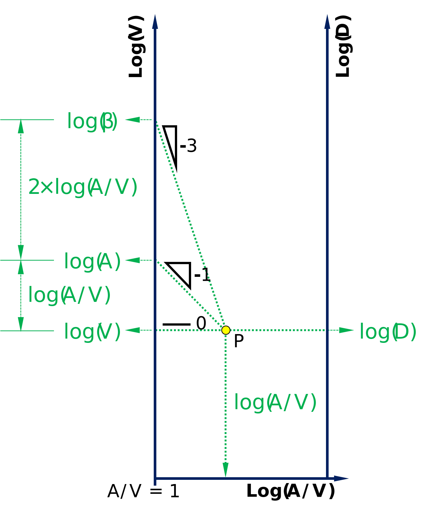
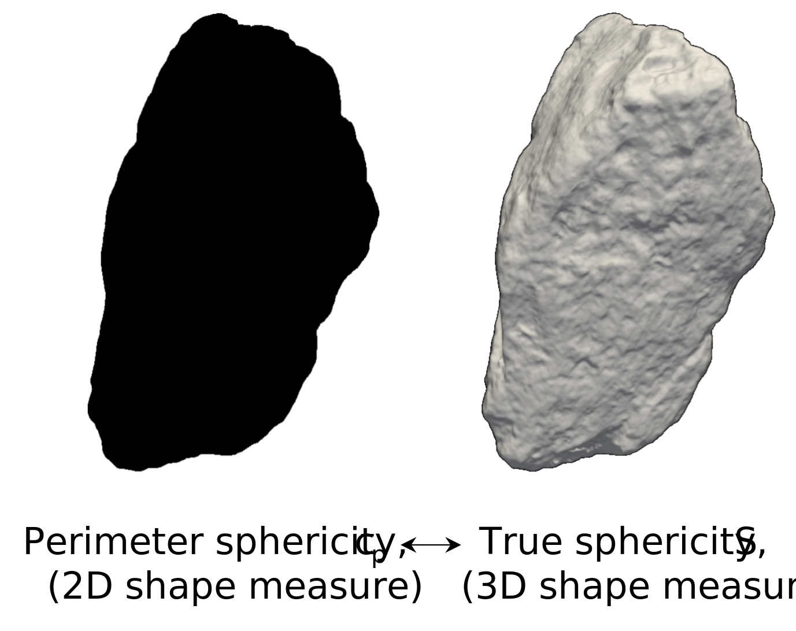
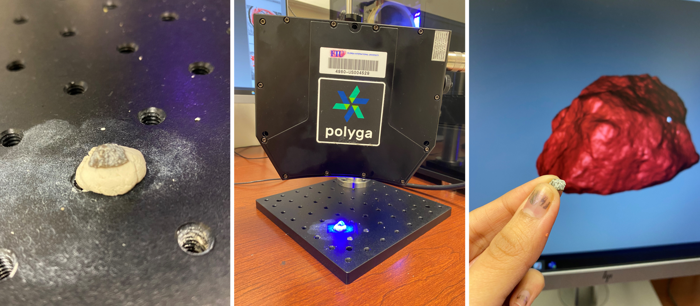

## **Selected Publications**

**Particle Geometry Space: An integrated characterization of particle shape, surface area, volume, specific surface, and size distribution**\
[https://doi.org/10.1016/j.trgeo.2025.101579](https://doi.org/10.1016/j.trgeo.2025.101579)\
This work introduces Particle Geometry Space (PGS), a unified analytical framework integrating particle size (*D*), shape (*β*), surface area (*A*), volume (*V*), and specific surface (*A/V*) into a single geometry-based representation. Moving beyond conventional isolated methods by characterizing size or shape, PGS enables systematic interpretation of all 3D particle geometry attributes in a single space and its relationship to granular material behavior while extending the traditional particle size distribution concept into a multidimensional framework.

**Towards 3D shape estimation from 2D particle images: a state-of-the-art review and demonstration**\
[https://doi.org/10.14356/kona.2025017](https://doi.org/10.14356/kona.2025017)\
This work investigates the relationship between 2D and 3D particle shape characterization to enable efficient estimation of 3D particle geometry from limited 2D images. Through analysis of approximately 400 mineral particles, the study reveals a strong correlation between 2D perimeter circularity (*c*p) and Wadell’s true sphericity (*S*) defined in 3D, establishing a cost-effective framework for reliable particle shape characterization.

---

## **Sponsored Projects**

**Collaborative Research: A New Theory of 3D Particle Characterization**\
[Sponsor: National Science Foundation (PI: Seung Jae Lee)](https://www.nsf.gov/awardsearch/show-award?AWD_ID=1938431)\
This project develops a new theory for comprehensive 3D particle geometry characterization by integrating volume, surface area, size, and shape into a unified framework. The research investigates the coupled influence of these geometry attributes on granular material behavior, including strength and dilatancy, enabling improved understanding and design of civil infrastructure subjected to natural hazards.
