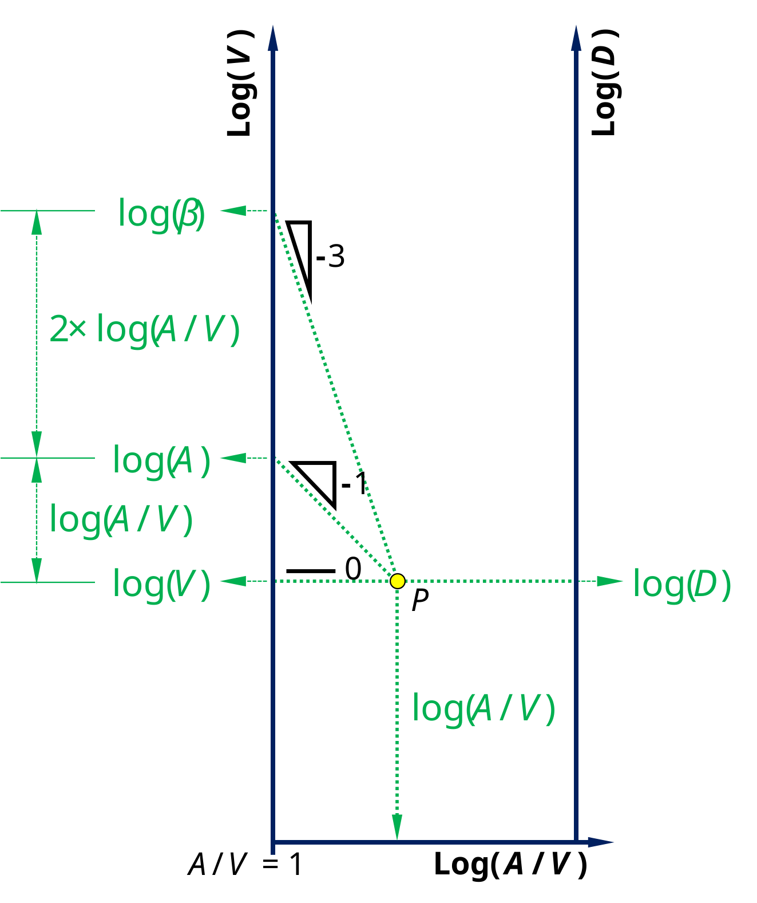
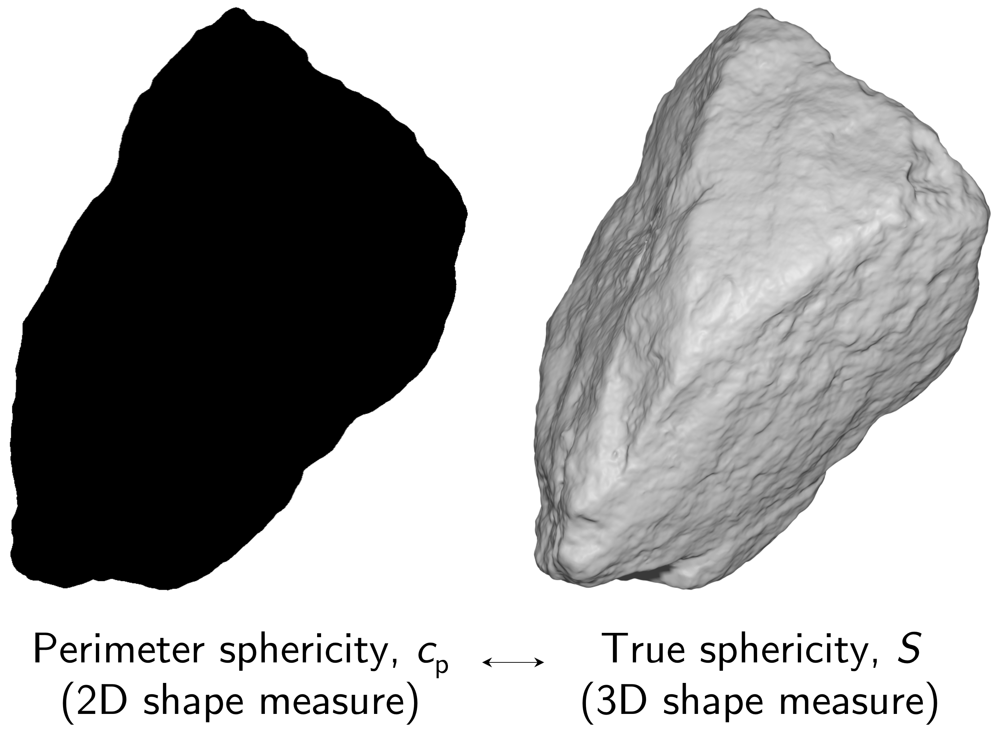
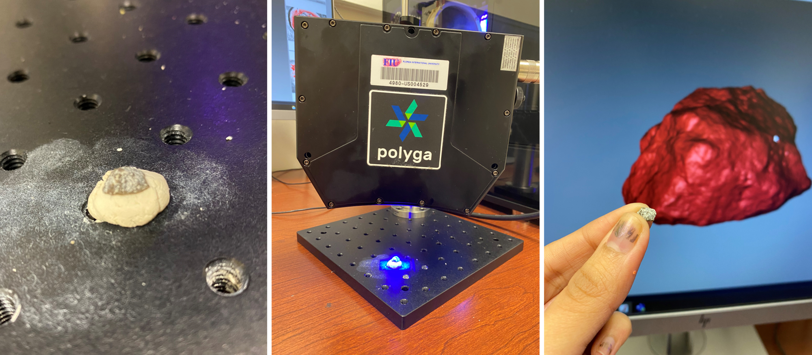

## **Selected Publications**

**Particle Geometry Space (PGS): An Integrated Characterization of Particle Shape, Surface Area, Volume, Specific Surface, and Size Distribution**\
[https://doi.org/10.1016/j.trgeo.2025.101579](https://doi.org/10.1016/j.trgeo.2025.101579)\
This work introduces Particle Geometry Space (PGS), a unified analytical framework integrating particle size (*D*), shape (*β*), surface area (*A*), volume (*V*), and specific surface (*A/V*) into a single geometry-based representation. Moving beyond conventional isolated methods by characterizing size or shape, PGS enables systematic interpretation of all 3D particle geometry attributes in a single space and its relationship to granular material behavior while extending the traditional particle size distribution concept into a multidimensional framework.

**Towards 3D Shape Estimation from 2D Particle Images: A State-of-the-Art Review and Demonstration**\
[https://doi.org/10.14356/kona.2025017](https://doi.org/10.14356/kona.2025017)\
This work investigates the relationship between 2D and 3D particle shape characterization to enable efficient estimation of 3D particle geometry from limited 2D images. Through analysis of approximately 400 mineral particles, the study reveals a strong correlation between 2D perimeter circularity (*c*p) and Wadell’s true sphericity (*S*) defined in 3D, establishing a cost-effective framework for reliable particle shape characterization.

---

## **Sponsored Projects**

{{< research-captioned-entry image="opportunity-wheel.gif" alt="NASA Mars rover Opportunity wheel stuck in sand" caption_title="**NASA's Mars rover** ***Opportunity*** **wheel stuck in sand.**" caption="NASA's Mars rover *Opportunity* became trapped in a ripple of loose sand in 2005, requiring nearly five weeks of carefully planned maneuvers to escape. This incident highlights the importance of accurate and computationally efficient regolith contact models for predicting wheel traction and mobility and reducing risk in future lunar and planetary surface operations." >}}
**Rapid Contact Dynamics for Surface Operations**\
[Sponsor: National Aeronautics and Space Administration (PI: Seung Jae Lee)](https://www.herox.com/NASAMPLAN/updates)\
This project develops a rapid, high-fidelity computational framework for simulating interactions between lunar regolith and surface systems such as rover wheels, lander footpads, excavation tools, and construction equipment. The research aims to overcome the high computational cost of conventional discrete element method (DEM) simulations while preserving high fidelity of granular contact behavior. By enabling efficient modeling of traction, sinkage, excavation forces, terrain disturbance, and regolith-structure interactions, the project supports virtual prototyping and mission planning for NASA's Artemis program and future sustained lunar surface operations. The rapid simulation capability can also enable large-scale generation of high-fidelity datasets for emerging AI-assisted modeling and design applications.


**A New Theory of 3D Particle Characterization**\
[Sponsor: National Science Foundation (PI: Seung Jae Lee)](https://www.nsf.gov/awardsearch/show-award?AWD_ID=1938431)\
This project develops a new theory for comprehensive 3D particle geometry characterization by integrating volume, surface area, size, and shape into a unified framework. The research investigates the coupled influence of these geometry attributes on granular material behavior, including strength and dilatancy, enabling improved understanding and design of civil infrastructure subjected to natural hazards.
