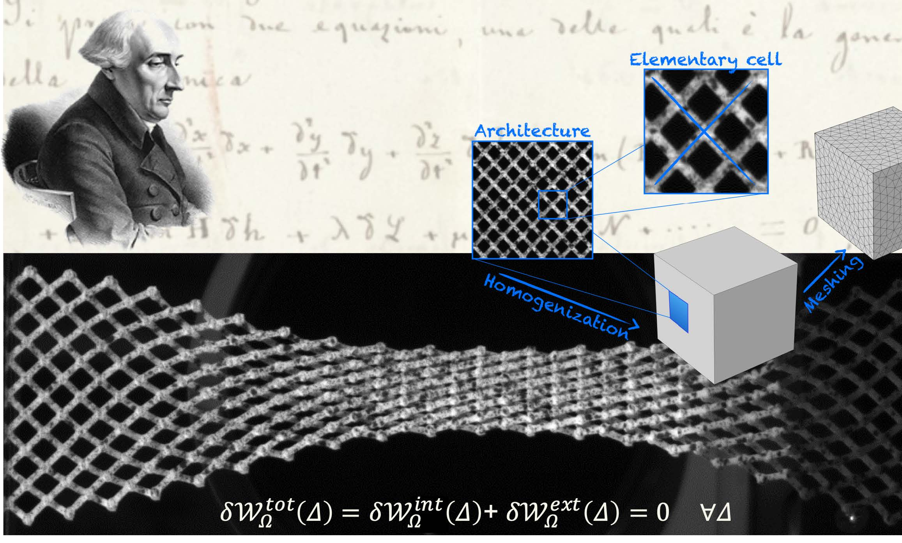
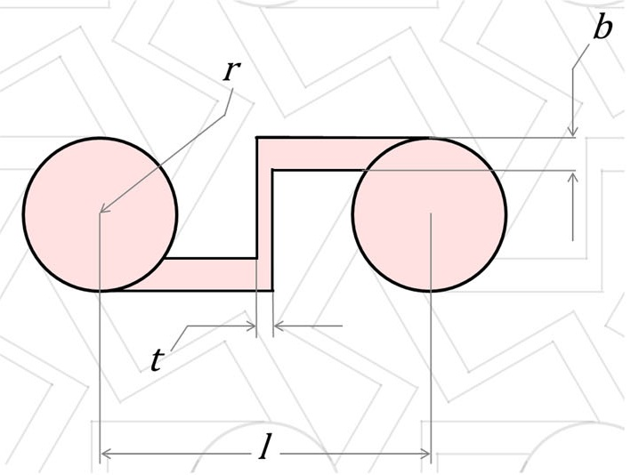
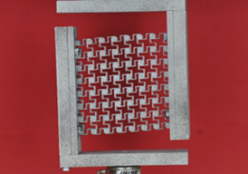

## **Selected Publications**

**Principle of VirtualWork as Foundational Framework forMetamaterial Discovery and Rational Design**\
[https://doi.org/10.5802/crmeca.151](https://doi.org/10.5802/crmeca.151)\
This work presents the principle of virtual work as a unifying framework for developing generalized continuum theories and architected metamaterials. By connecting grain-scale interactions and microstructure to emergent macroscale behavior through micro-macro identification, the study demonstrates how granular and pantographic architectures can be designed to exhibit nonclassical mechanical responses beyond the limits of conventional continuum mechanics.

**Chiral metamaterial predicted by granular micromechanics: verified with 1D example synthesized using additive manufacturing**\
[https://doi.org/10.1007/s00161-020-00862-8](https://doi.org/10.1007/s00161-020-00862-8)\
This work presents that chiral metamaterial behavior can emerge directly from grain-scale interaction mechanisms predicted through the Granular Micromechanics Approach (GMA). Closed-form constitutive relations show that coupling between normal and tangential grain-pair deformations generates macroscale chirality and nonclassical micromorphic behavior. The theoretical predictions are verified through finite and discrete element modeling, and additively manufactured 3D-printed bead-string experiments, establishing a direct bridge between grain-scale mechanics, continuum theory, and architected metamaterial design.

---

## **Sponsored Projects**

**Non-classical Micromorphic Continuum Model for Granular Microstructure Design**\
[Sponsor: National Science Foundation (PI: Anil Misra)](https://www.nsf.gov/awardsearch/show-award?AWD_ID=1727433)\
This award supports fundamental research on granular solids by developing efficient and accurate micromorphic continuum models that connect grain-scale interactions and microstructure to macroscopic mechanical behavior. The project advances predictive tools for engineered granular materials with tunable properties, enabling applications in infrastructure, aerospace, biomedical, and manufacturing systems while promoting interdisciplinary STEM education and workforce development.
