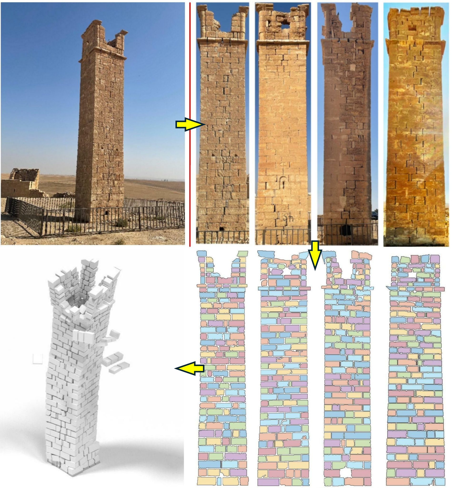

## **Selected Publications**

**Image-Based 3D Modeling-to-Simulation of Single-Wythe Masonry Structure via Reverse Descriptive Geometry**\
[https://doi.org/10.1016/j.jobe.2023.107125](https://doi.org/10.1016/j.jobe.2023.107125)\
This study develops an image-based 3D modeling-to-simulation framework for rapid vulnerability assessment of single-wythe historic masonry structures. Using reverse descriptive geometry, 2D wall images are transformed into 3D discrete element models for seismic analysis. The framework combines automated geometry reconstruction, impulse-based dynamic simulation, and high-fidelity masonry modeling to enable efficient, accurate, and computationally scalable hazard assessment.


**Phenotypic Trait of Painting Cracks**\
[https://doi.org/10.1080/00393630.2024.2420574](https://doi.org/10.1080/00393630.2024.2420574)\
This study develops an image-based framework to quantify the geometric characteristics of painting cracks using phenotypic trait analysis. Individual crack islands are extracted and analyzed to reveal self-similar patterns governed by power-law relationships. The framework provides a quantitative basis for identifying provenance-related characteristics in artworks and advances data-driven approaches for cultural heritage assessment and art authentication.


---

## **Sponsored Projects**

**Image-based Streamlined Analysis Framework for Hazard Vulnerability Assessment of Historic Masonry Structures**\
[Sponsor: US Department of the Interior / National Park Service (PI: Seung Jae Lee)](https://www.nps.gov/)\
This project develops a next-generation Imaging-to-Simulation framework that integrates computer vision, 3D reconstruction, and high-fidelity discrete element modeling to enable efficient, scalable hazard vulnerability assessment of historic masonry structures. The framework enhances predictive capabilities for preservation planning by identifying likely deterioration and failure scenarios before they occur.

