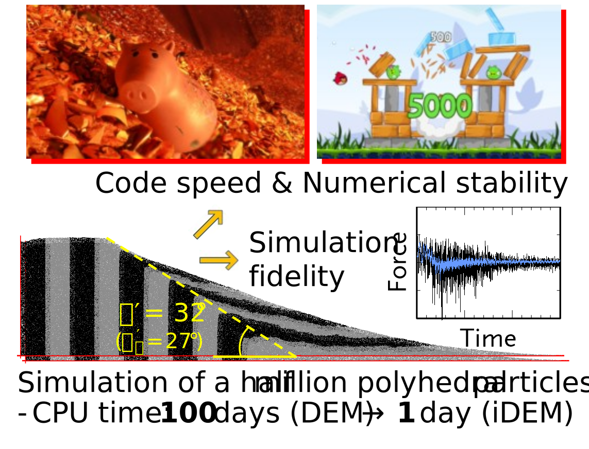
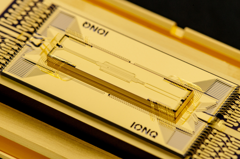

## **Selected Publications**

**iDEM: An impulse-based discrete element method for fast granular dynamics**\
[https://doi.org/10.1002/nme.4923](https://doi.org/10.1002/nme.4923)\
This work introduces an impulse-based discrete element method (iDEM) for efficient simulation of granular materials. By replacing contact-force calculations with collision impulses and directly updating particle velocities, the method bypasses acceleration integration while preserving fidelity. The approach is numerically stable and achieves speedups approaching two orders of magnitude over conventional DEM, enabling large-scale simulations on accessible computing hardware. 

**Numerical modelling of large deformation problems in geotechnical engineering: A state-of-the-art review**\
[https://doi.org/10.1016/j.sandf.2021.08.007](https://doi.org/10.1016/j.sandf.2021.08.007)\
This highly cited review synthesizes the state of the art in computational geomechanics for large deformation problems. Covering both continuum and discontinuum approaches, including the Finite Element Method (FEM), Material Point Method (MPM), Smoothed Particle Hydrodynamics (SPH), Particle Finite Element Method (PFEM), and Discrete Element Method (DEM), it assesses the strengths, limitations, and future challenges of modern numerical modelling techniques. The review serves as a comprehensive guide for researchers and practitioners addressing landslides, foundation installation, soil failure, and other geotechnical problems involving large deformation.

---

## **Sponsored Projects**

**BRITE Pivot: DEMIAN - Discrete Element Method Infused with Artificial Neural computations**\
[Sponsor: National Science Foundation (PI: Seung Jae Lee)](https://www.nsf.gov/awardsearch/show-award?AWD_ID=2527265)\
This project develops DEMIAN (Discrete Element Method Infused with Artificial Neural computations), a next-generation discrete element simulation framework that integrates AI-driven computations to enable real-time, high-fidelity simulation of granular materials at unprecedented scale. 

**QUAD: Quantum Computing-Accelerated Discrete Element Method**\
[Sponsor: FIU Office of the Provost (PI: Seung Jae Lee)](https://provost.fiu.edu/)\
This project aims to develop QUAD, a quantum computing–accelerated discrete element method for simulating granular materials. By reformulating DEM computational bottlenecks to exploit quantum computing, the project seeks to dramatically accelerate large-scale particle simulations beyond the limits of conventional and high-performance computing, enabling transformative advances in granular mechanics, hazard prediction, and engineering design.

