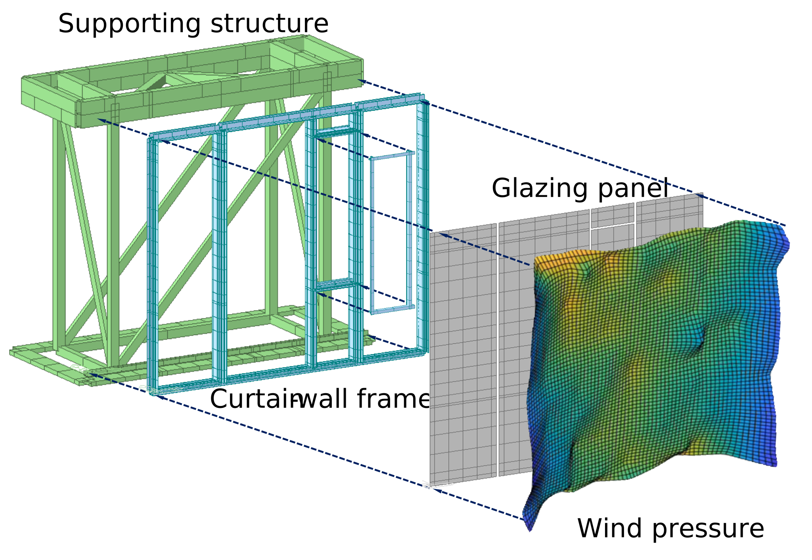
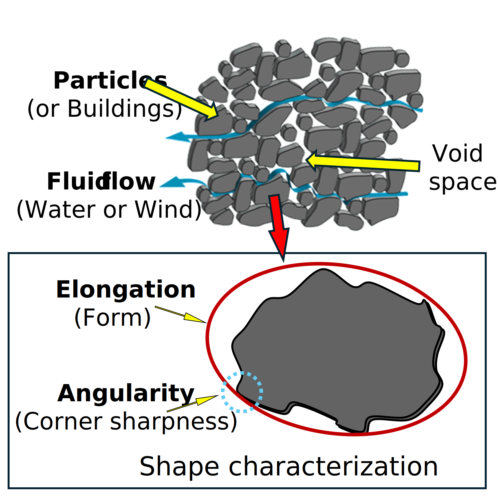
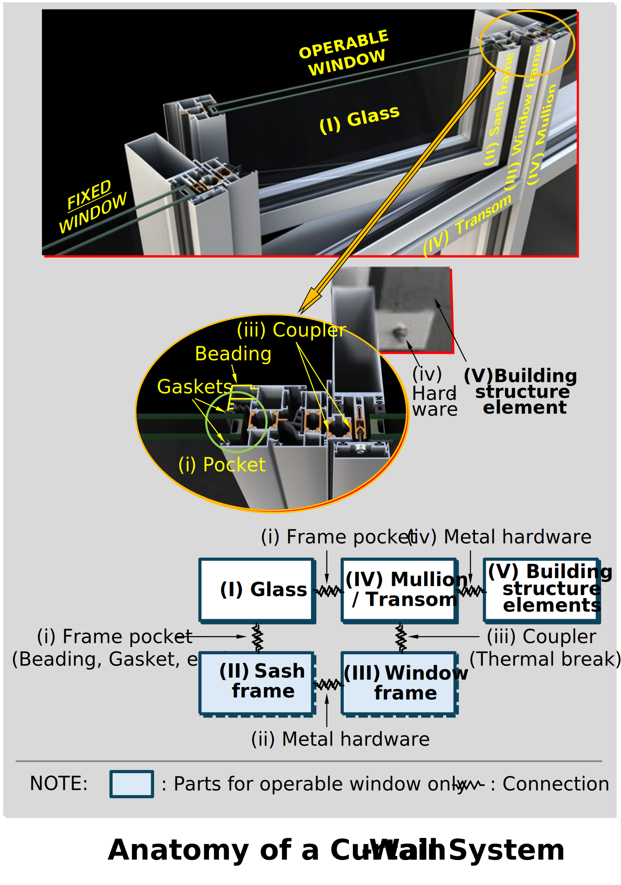

## **Selected Publications**

**Wind-Induced Dynamic Behavior of Single-Skin Curtain-Wall System: A Comparative Numerical Study**\
[https://doi.org/10.1061/JAEIED.AEENG-1725](https://doi.org/10.1061/JAEIED.AEENG-1725)\
This work advances the understanding of wind-induced dynamic behavior in building façades through the development of high-fidelity numerical models for single-skin curtain-wall systems. By representing façades as interconnected mechanical systems with operable components rather than a simplified plate model, the study captures the dynamic response under wind loading while maintaining practical computational efficiency. This study demonstrates that façade performance is strongly influenced by interactions with the supporting building structure, revealing that identical façade systems may exhibit different dynamic characteristics depending on the structures to which they are attached. These findings challenge conventional modeling assumptions and open new directions for performance-based façade design and analysis.

**Influence of Building Shape-Factor on Wind Loads for Non-Rectangular Low-Rise Structures**\
[https://doi.org/10.1016/j.jobe.2026.115314](https://doi.org/10.1016/j.jobe.2026.115314)\
This work advances the understanding of wind effects on non-rectangular low-rise buildings by adapting shape-characterization concepts originally developed for granular media. Recognizing the striking similarities between airflow around complex building layouts and fluid transport through granular media, the study introduces a set of shape-factors that quantify building plan geometry using objective, physically meaningful descriptors. Analysis of extensive wind tunnel data demonstrates that these shape-factors capture important trends in local pressures and global wind-load effects, including base shear, uplift, and torsional response. The results reveal consistent relationships between shape-factors and wind-load characteristics, establishing a systematic framework for evaluating and comparing the aerodynamic performance of irregular building forms and opening new opportunities for shape-informed wind-resistant design.

---

## **Sponsored Projects**

**Investigation of Wind-Driven Rain and Wind-Induced Vibration Effects on Curtain-Wall Systems**\
[Sponsor: NSF WHIP Industry-University Cooperative Research Center (PI: Seung Jae Lee / Amal Elawady)](https://whipc.org/)\
This work investigates the coupled effects of wind-driven rain and wind-induced vibrations on curtain-wall systems through full-scale experimentation and numerical simulation. By evaluating façade performance under realistic hurricane conditions, the study captures the interactions between dynamic structural response and water intrusion. The results reveal that façade geometry, architectural protrusions, installation details, and dynamic wind-induced deformations can significantly influence both vibration characteristics and water-tightness, highlighting limitations of conventional approaches. The research establishes a framework for assessing façade vulnerability under combined wind and rain hazards, providing new insights for resilient curtain-wall design and improved performance-based testing standards.
